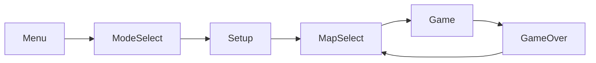

# CLAUDE.md

This file provides guidance to Claude Code (claude.ai/code) when working with code in this repository.

## Build & Run

```bash
cmake -B build
cmake --build build
./build/Debug/TankGame.exe
```

Clean rebuild: `rm -rf build && cmake -B build && cmake --build build`

Requires: CMake 3.20+, C++23 compiler. raylib is fetched automatically via CMake FetchContent.

`CMAKE_EXPORT_COMPILE_COMMANDS` is ON — `build/compile_commands.json` is generated for IDE tooling.

## Key Constants

- **Screen**: 832×832 (13×13 tile grid, 64px per tile) — defined in `src/core/Types.h`
- **Map format**: `.txt` files in `assets/maps/` organized by mode (`traditional/`, `attack_defend/`, `ffa/`)
- **Assets**: Textures and sounds are **procedurally generated** at startup by `TextureGenerator` / `SoundGenerator` — the only binary assets are the font file and map text files
- **No test suite** — there are no test targets, test frameworks, or CI configured

## Architecture

A 90s-style top-down tank arena game with 2v2 team battles, local multiplayer, and LAN multiplayer.

### Game Flow



详细场景流转和控制方案见 [docs/game-flow.md](docs/game-flow.md)。

- **No single-player campaign, no levels, no progression**
- **2v2**: 2 humans + 2 AI, all modes
- **Three modes**: Traditional / Attack-Defend / Free-For-All
- **Room-based**: configure teams, pick a map, then fight
- **Dual mode**: Hot Seat + LAN (Host-Authoritative)

### Design Patterns
- **Component Pattern**: Entity holds Components (Transform, Sprite, Collider, Health, Movement)
- **Strategy Pattern**: Tank uses `IController` — `PlayerController` (keyboard), `AIController`, or `NetController` (LAN)
- **Factory Pattern**: `TankFactory` assembles Tank + Components + Controller from a `TankType` enum
- **State Pattern**: `SceneManager` manages a stack of `Scene` subclasses with 6 navigation semantics: `PushScene`, `PopScene`, `SetupNext` (replace top), `StartGame` (trim + push), `ReturnTo` (scan + pop), `ReturnToMenu`
- **Observer Pattern**: `EventSystem` decouples game events from listeners
- **PIMPL Pattern**: `NetworkManager` isolates Winsock2 from raylib
- **Singleton**: `EventSystem`, `ResourceManager`, `AudioManager` (Meyers' singleton)

### AI Controller

`AIController` uses a 3-state FSM: **PATROL** → **CHASE** (enemy within 300px) → **ATTACK** (in range, fires on cooldown). Configured via `SetAllTanks()` and `SetBases()` static methods.

### Key Modules

| Directory | Purpose |
|---|---|
| `src/core/` | Engine: game loop, window, input, audio, events |
| `src/ecs/` | Entity-Component system |
| `src/game/tank/` | Tank base class, TankType stats, TankFactory, IController |
| `src/game/entities/` | Bullet, Wall, Base, PowerUp |
| `src/game/map/` | GameMap, MapManager, TileType |
| `src/game/systems/` | CollisionSystem, ParticleSystem |
| `src/game/session/` | GameSession (4 slots, team config, AI randomization) |
| `src/net/` | NetworkManager (PIMPL), NetProtocol, NetController |
| `src/scene/` | SceneManager + 14 scenes (7 hot-seat + 4 LAN + 3 shared) |
| `src/ui/` | HUD overlay |

### Tank System

All tanks share the `Tank` base class. Stats are driven by `TankType` enum + `TANK_STATS` table:
- **LIGHT**: fast (100), low HP (1), rapid fire (0.5s), dual shot
- **MEDIUM**: balanced (80), 2 HP, 1 armor
- **HEAVY**: slow (55), 3 HP, 2 armor, high damage
- **SPEED**: extremely fast (130), fragile (1 HP), triple shot (0.3s)

Control is via `IController` strategy — same Tank class works for human or AI players.

### Network Protocol

Binary protocol defined in `src/net/NetProtocol.h`. Messages: `[4B length][4B magic "TB90"][2B type][2B size][payload]`.
- **TCP**: lobby/reliable messages (connection, lobby config, game start)
- **UDP**: fast game state — host broadcasts at 20Hz (`NetPlayerState` + `NetBulletState`), client sends input at ~60Hz (`NetInputPayload` bit mask)
- Host-authoritative: host runs all game logic, client is pure rendering (`LANGameScene`)
- `NetworkManager` uses PIMPL to hide Winsock2; `NetworkOwner.h` provides a `unique_ptr` with forward-declared deleter for ownership transfer between scenes

### Conventions
- Headers (`.h`) for declarations, source (`.cpp`) for implementations
- Each subdirectory has a `README.md`
- Use `#pragma once` for header guards
- Prefer `std::unique_ptr` ownership, raw pointers for non-owning references
- All game constants in `Types.h` or the relevant stats table
- **文档图表必须使用 Mermaid** — 流程图、类图、状态图、时序图等，不要用 ASCII art 或纯文本图示，放在 `docs/` 目录下
