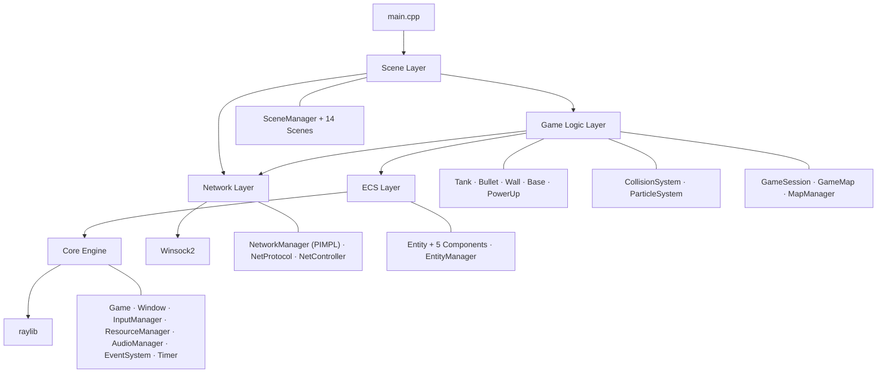
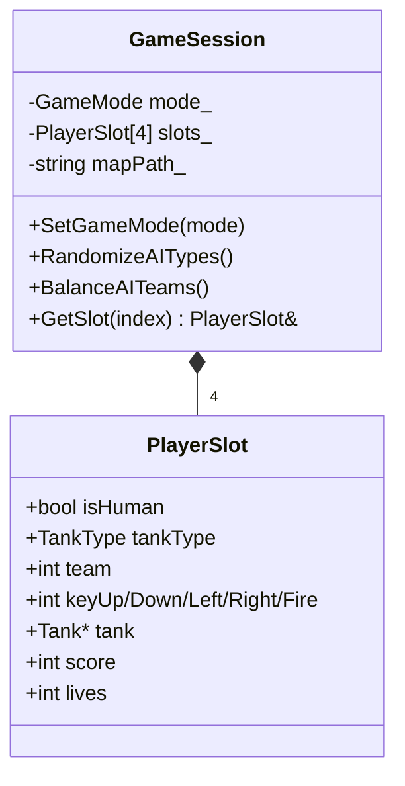
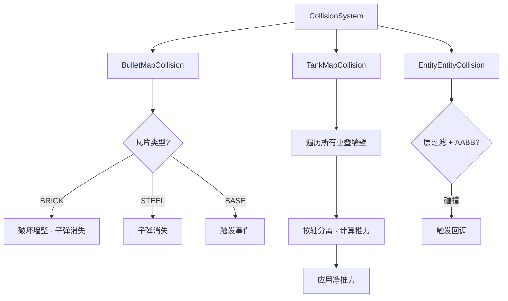
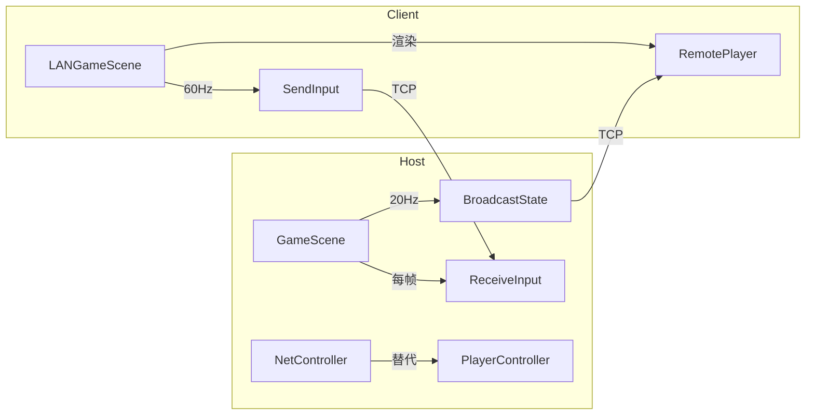

# 架构设计 — Tank Battle 90s

技术栈：**C++23 / CMake / raylib 5.5 / Winsock2 (LAN)**

---

## 1. 分层架构



**依赖方向：** 上层依赖下层，禁止反向依赖。Network Layer 通过 PIMPL 隔离 Winsock2，避免污染 raylib 命名空间。

---

## 2. 项目结构

```
tankGame/
├── CMakeLists.txt
├── assets/
│   ├── maps/            # 地图 (.txt)，按模式子目录分类
│   ├── textures/        # 精灵图
│   └── fonts/           # 字体
├── docs/                # 设计文档
└── src/
    ├── main.cpp
    ├── core/            # 引擎层
    ├── ecs/             # Entity-Component 系统
    ├── game/
    │   ├── tank/        # Tank · TankFactory · IController
    │   ├── entities/    # Bullet · Wall · Base · PowerUp
    │   ├── map/         # GameMap · MapManager
    │   ├── systems/     # CollisionSystem · ParticleSystem
    │   └── session/     # GameSession · PlayerSlot
    ├── net/             # NetworkManager · NetProtocol · NetController
    ├── scene/           # SceneManager + 14 Scenes
    ├── ui/              # HUD
    └── utils/           # MathUtils · TextureGenerator · SoundGenerator · Random
```

---

## 3. 场景系统

### 3.1 Scene 基类

```cpp
class Scene {
public:
    virtual ~Scene() = default;
    virtual void Enter() {}
    virtual void Exit() {}
    virtual void Update(float dt) = 0;
    virtual void Render() = 0;
    virtual bool IsOverlay() const { return false; }
};
```

### 3.2 SceneManager — 六种导航语义

| 方法 | 语义 | 栈行为 | 使用场景 |
|---|---|---|---|
| `PushScene` | 压入覆盖层 | 栈深度 +1 | Menu→ModeSelect, Game+Pause |
| `PopScene` | 恢复下层 | 栈深度 -1 | Pause→Game, ModeSelect ESC |
| `SetupNext` | 流程前进 | 替换栈顶，深度不变 | Setup→MapSelect, Game→GameOver |
| `StartGame` | 开始对战 | 保留 Menu+ModeSelect，清除设置链 | MapSelect→Game |
| `ReturnTo` | 语义回退 | 搜索目标，清除其上所有层 | (通用) |
| `ReturnToMenu` | 回主菜单 | ReturnTo(MenuScene) | 任何场景 ESC |

### 3.3 场景列表

**热座模式 (7 个场景)：**

| 场景 | 职责 | 导航 |
|---|---|---|
| MenuScene | 标题画面 | PushScene → ModeSelect |
| ModeSelectScene | 模式选择 (传统/攻防/各自为战) | PushScene → Setup; ESC → PopScene |
| SetupScene | 人/AI + 坦克 + 队伍配置 | SetupNext → MapSelect; ESC → PopScene |
| MapSelectScene | 按模式过滤地图选择 | StartGame → Game; ESC → SetupNext(Setup) |
| GameScene | 对战主循环 (含重生 + 网络 Host) | PushScene(Pause); 结束 → SetupNext(GameOver) |
| PauseScene | 暂停覆盖层 (IsOverlay) | PopScene 恢复; Q → ReturnToMenu |
| GameOverScene | 模式相关结算 | SetupNext(MapSelect) 再来一局; ESC → ReturnToMenu |

**联机模式 (4 个场景)：**

| 场景 | 职责 | 导航 |
|---|---|---|
| LANModeSelectScene | Host / Join 选择 | PushScene → LANLobby; ESC → PopScene |
| LANLobbyScene | Host: 选图/队伍/坦克; Client: 选坦克/输入 IP | 启动游戏 → GameScene/LANGameScene; ESC → ReturnToMenu |
| LANGameScene | 客户端：接收状态渲染 + 发送输入 | ESC → ReturnToMenu |
| GameNetworkHost | 辅助类：网络广播/同步 (从 GameScene 调用) | — |

### 3.4 统一流程

```
[Menu]
  PushScene(ModeSelect)          → [Menu, ModeSelect]
  PushScene(Setup)               → [Menu, ModeSelect, Setup]
  SetupNext(MapSelect)           → [Menu, ModeSelect, MapSelect]
  StartGame(Game)                → [Menu, ModeSelect, Game]
  PushScene(Pause) overlay       → [Menu, ModeSelect, Game, Pause]
  PopScene()                     → [Menu, ModeSelect, Game]
  SetupNext(GameOver)            → [Menu, ModeSelect, GameOver]
  ENTER: SetupNext(MapSelect)    → [Menu, ModeSelect, MapSelect]  ← 再来一局
  ESC: ReturnToMenu()            → [Menu]
```

---

## 4. 游戏模式

| 模式 | 队伍 | 基地 | 重生 | 胜利条件 |
|---|---|---|---|---|
| **传统对战** | 2 队 (每队 1 人 + 1 AI) | 2 个 | 无 | 摧毁敌方基地 / 全灭敌方 |
| **攻防战** | 2 队 (攻 1 人 + 守 1 人，各配 1 AI) | 1 个 (守方) | 守方无限 (3s 延迟) / 攻方 3 命 | 攻方: 摧毁基地或消灭守方 / 守方: 消灭攻方 |
| **各自为战** | 无队伍 (2 人 + 2 AI 各自) | 无 | 无 | 最后存活者 |

所有模式始终 **2 真人 + 2 AI**。AI 坦克类型在游戏开始时随机分配。

---

## 5. 坦克系统

### 5.1 设计：组合优于继承

一个 `Tank` 类 + `TankType` 枚举 + `TankStats` 属性表 + `IController` 策略接口。

```cpp
class Tank {
    TankType type_;                          // 查属性表
    std::unique_ptr<IController> controller_; // 人类 / AI / 网络
    Entity* entity_;                          // ECS 实体
    int team_;
};
```

### 5.2 属性表 (数据驱动)

| 类型 | 移动速度 | 子弹速度 | 伤害 | 生命 | 护甲 | 冷却 | 最大子弹 | 特点 |
|---|:---:|:---:|:---:|:---:|:---:|:---:|:---:|---|
| **LIGHT** | 100 | 350 | 1 | 1 | 0 | 0.5s | 2 | 快速、脆皮、双发 |
| **MEDIUM** | 80 | 300 | 2 | 2 | 1 | 0.7s | 1 | 均衡、减伤 |
| **HEAVY** | 55 | 250 | 2 | 3 | 2 | 1.0s | 1 | 慢、肉、高甲 |
| **SPEED** | 130 | 400 | 1 | 1 | 0 | 0.3s | 3 | 极速、极脆、三连发 |

> 护甲减伤：`effectiveDamage = max(1, bulletDamage - armor)`
> 子弹速度设计：>= 最快坦克速度 x2.5，确保子弹能追上所有坦克

### 5.3 控制器策略

| 控制器 | 使用场景 |
|---|---|
| PlayerController | 本地人类玩家 (键盘) |
| AIController | AI 坦克 (PATROL→CHASE→ATTACK 状态机) |
| NetController | 联机远程玩家 (Host 端接收网络输入) |

---

## 6. 会话管理



GameSession 沿场景栈 move 传递：Setup → MapSelect → Game → GameOver。

---

## 7. 地图系统

13x13 瓦片网格，每个瓦片 64x64 像素，总尺寸 832x832。

| 瓦片 | 含义 | 可破坏 | 可通行 |
|---|---|:---:|:---:|
| EMPTY | 空地 | - | Y |
| BRICK | 砖墙 | Y | N |
| STEEL | 钢墙 | N | N |
| WATER | 水面 | N | N |
| GRASS | 草地 | - | Y |
| BASE | 基地标记 (加载后清除为 EMPTY) | - | Y |

地图按模式分目录：`assets/maps/traditional/`、`attack_defend/`、`ffa/`。MapManager 自动扫描。

---

## 8. 碰撞系统



TankMapCollision 使用**重叠推力**算法：对 X/Y 轴独立检测所有重叠墙壁，按方向分组推力，应用净推量。正确处理 T 型路口多墙碰撞。

---

## 9. 网络架构

### 9.1 Host-Authoritative 模型



### 9.2 PIMPL 隔离

Winsock2 头文件 (`winsock2.h`, `ws2tcpip.h`) 与 raylib 的 `Rectangle`、`DrawText` 等冲突。通过 PIMPL 将所有 socket 类型隐藏在 `NetworkManager::Impl` 中。

### 9.3 所有权转移

```
LANLobbyScene (unique_ptr<NetworkManager>)
  ↓ ReleaseNetwork()
GameScene / LANGameScene (NetworkManagerPtr, 前向声明删除器)
  ↓ 析构时自动清理
```

---

## 10. 关键文件索引

| 文件 | 职责 |
|---|---|
| `src/core/Types.h` | 游戏常量、GameMode、Direction 枚举 |
| `src/core/Game.h/.cpp` | 主循环入口 |
| `src/core/EventSystem.h/.cpp` | 观察者模式事件分发 |
| `src/ecs/Entity.h/.cpp` | 实体 + 组件管理 |
| `src/game/tank/Tank.h/.cpp` | 坦克核心 |
| `src/game/tank/TankType.h` | 属性表 (数据驱动) |
| `src/game/tank/TankFactory.h/.cpp` | 工厂模式 |
| `src/game/tank/controller/IController.h` | 控制器接口 |
| `src/game/tank/controller/AIController.h/.cpp` | AI 状态机 |
| `src/game/map/GameMap.h/.cpp` | 瓦片网格 |
| `src/game/map/MapManager.h/.cpp` | 地图扫描/选择 |
| `src/game/session/GameSession.h/.cpp` | 4 槽位会话 |
| `src/game/systems/CollisionSystem.h/.cpp` | 碰撞检测 |
| `src/net/NetProtocol.h` | 网络协议、序列化 |
| `src/net/NetworkManager.h/.cpp` | PIMPL 网络管理器 |
| `src/net/NetController.h/.cpp` | 网络控制器 |
| `src/scene/SceneManager.h/.cpp` | 语义化场景导航 |
| `src/scene/GameScene.h/.cpp` | 对战主场景 |
| `src/scene/GameNetworkHost.h/.cpp` | 网络 Host 广播 |
| `src/scene/SetupScene.h/.cpp` | 配置界面 (人/AI + 坦克 + 队伍) |
| `src/scene/LANLobbyScene.h/.cpp` | LAN 大厅 |
| `src/scene/LANGameScene.h/.cpp` | 客户端游戏渲染 |
| `src/ui/HUD.h/.cpp` | 游戏内 HUD |
