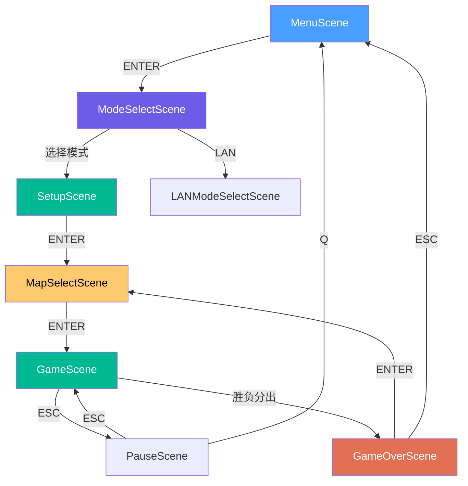
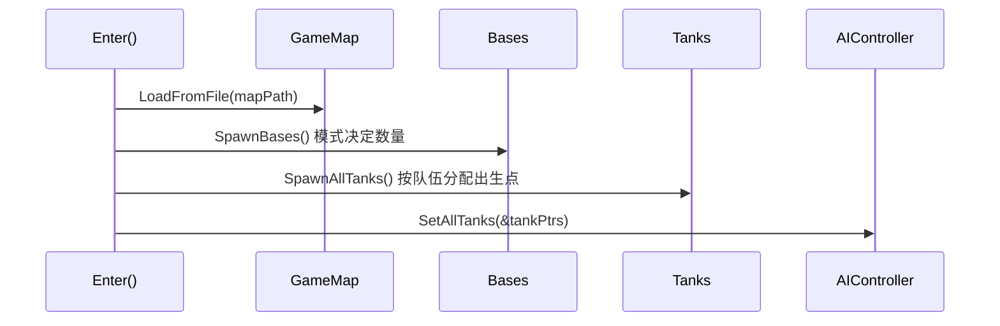
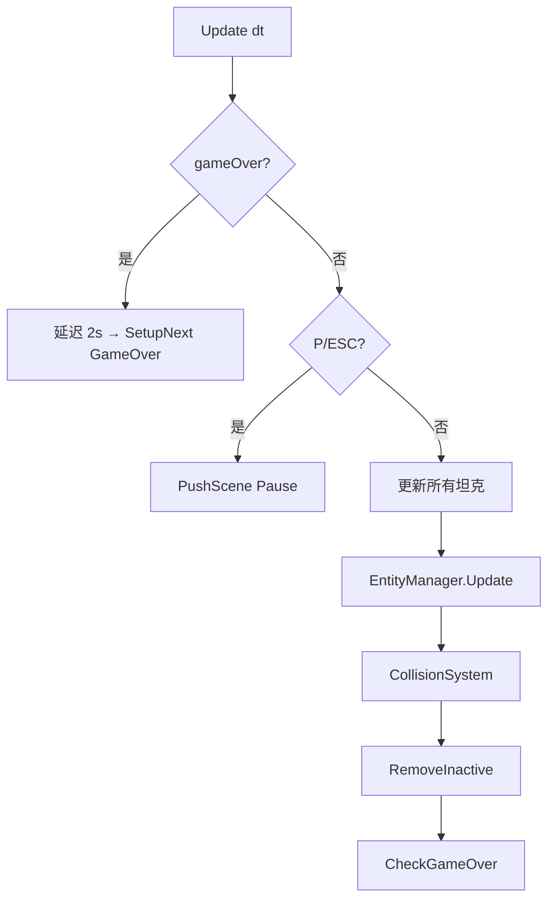
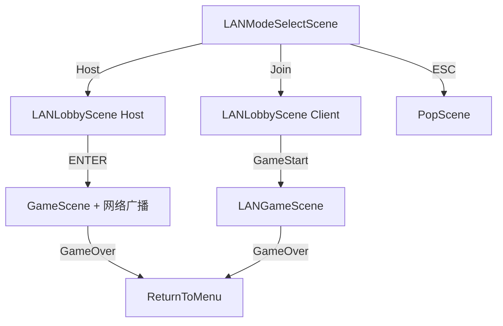

# 场景流转 — Tank Battle 90s

## 全局导航



### SceneManager 导航语义

| 方法 | 语义 | 栈行为 |
|---|---|---|
| `PushScene` | 压入覆盖层 | 栈深度 +1 |
| `PopScene` | 恢复下层 | 栈深度 -1 |
| `SetupNext` | 流程前进 | 替换栈顶 |
| `StartGame` | 开始对战 | 保留 Menu+ModeSelect，清除设置链 |
| `ReturnTo` | 语义回退 | 搜索目标，清除其上所有层 |
| `ReturnToMenu` | 回主菜单 | ReturnTo(MenuScene) |

---

## 1. MenuScene — 主菜单

> 标题画面，等待玩家按 Enter。

- 黑底，"TANK BATTLE" 绿色大标题
- 闪烁的 "PRESS ENTER TO START"

| 键位 | 动作 |
|---|---|
| ENTER | PushScene → ModeSelectScene |

**文件：** `src/scene/MenuScene.h/.cpp`

---

## 2. ModeSelectScene — 模式选择

> 选择游戏模式。

| 键位 | 动作 |
|---|---|
| UP/DOWN | 切换模式 |
| ENTER | PushScene → SetupScene |
| ESC | PopScene → MenuScene |

三种模式：传统对战 / 攻防战 / 各自为战。所有模式始终 2 真人 + 2 AI。

**文件：** `src/scene/ModeSelectScene.h/.cpp`

---

## 3. SetupScene — 游戏配置

> 在同一界面完成：人/AI 切换、坦克类型选择、队伍分配。

| 键位 | 动作 |
|---|---|
| UP/DOWN | 切换当前槽位 (P1-P4) |
| TAB | 切换当前槽位的 Human / AI (自动平衡 AI 队伍) |
| LEFT/RIGHT | 传统/攻防: 切换队伍; 各自为战: 切换坦克类型 |
| ENTER | SetupNext → MapSelectScene |
| ESC | PopScene → ModeSelectScene |

### 模式默认配置

| 模式 | 默认队伍 | 可切换 |
|---|---|---|
| **传统对战** | P1=P2 同队, P3=P4 另一队 | LEFT/RIGHT 切换队伍 |
| **攻防战** | P1=ATK, P2=DEF, AI 自动平衡 | LEFT/RIGHT 切换队伍 |
| **各自为战** | 4 人各自独立 | LEFT/RIGHT 切换坦克类型 |

AI 队伍自动平衡：人类切换队伍时，AI 槽位分配到人数较少的队伍。

**文件：** `src/scene/SetupScene.h/.cpp`

---

## 4. MapSelectScene — 地图选择

> 预览并选择对战地图。支持平滑滑动动画。

| 键位 | 动作 |
|---|---|
| LEFT/RIGHT | 切换地图 (带动画) |
| ENTER | StartGame → GameScene |
| ESC | SetupNext → SetupScene (保留配置) |

地图按模式自动过滤：传统模式只显示 `traditional/` 目录地图，依此类推。

**文件：** `src/scene/MapSelectScene.h/.cpp`

---

## 5. GameScene — 对战主场景

> 核心游戏循环：生成 → 更新 → 碰撞 → 渲染 → 胜负判定。

### 初始化流程



### 每帧更新



### 胜负判定

| 模式 | 条件 | 结果 |
|---|---|---|
| 传统对战 | 某方基地被摧毁 | 基地方输，对方赢 |
| 传统对战 | 某方全灭 | 全灭方输，对方赢 |
| 攻防战 | 攻方基地被摧毁 | 攻方赢 |
| 攻防战 | 攻方全灭 (3 命用尽) | 守方赢 |
| 各自为战 | 仅剩 1 人存活 | 存活者赢 |

### 重生系统 (攻防战)

- 守方死亡后 3 秒自动重生，附带 2 秒无敌
- 攻方死亡消耗命数 (初始 3 命)，命数耗尽不再重生

**文件：** `src/scene/GameScene.h/.cpp`

---

## 6. PauseScene — 暂停 (Overlay)

> 游戏暂停覆盖层，叠加在 GameScene 之上。

| 键位 | 动作 |
|---|---|
| P / ESC | PopScene 恢复游戏 |
| Q | ReturnToMenu 退出到主菜单 |

- 半透明黑色遮罩
- `IsOverlay() = true` — 不清屏，画在下层场景之上
- 0.3 秒防误触保护

**文件：** `src/scene/PauseScene.h/.cpp`

---

## 7. GameOverScene — 结算

> 显示胜负结果，选择再来一局或退回菜单。

| 键位 | 动作 |
|---|---|
| ENTER | SetupNext → MapSelectScene (Play Again，保留会话) |
| ESC | ReturnToMenu → MenuScene |

- 模式相关结果文字："RED/BLUE WINS!" / "ATTACK/DEFEND WINS!" / "PLAYER X WINS!"
- 1 秒后显示操作提示
- 携带 GameSession 传递给 MapSelect，保留上次配置

**文件：** `src/scene/GameOverScene.h/.cpp`

---

## 8. LAN 联机模式

### 流转



### LANLobbyScene

**Host 界面：**

| 键位 | 动作 |
|---|---|
| UP/DOWN | 切换槽位 |
| LEFT/RIGHT | 切换当前槽位队伍 |
| Q/E | 切换当前槽位坦克类型 |
| A/D | 切换地图 |
| ENTER | 开始游戏 |
| ESC | 取消，返回主菜单 |

**Client 界面：**

| 阶段 | 操作 |
|---|---|
| 未连接 | 输入 Host IP (数字 + 点)，ENTER 连接 |
| 已连接 | UP/DOWN 浏览, LEFT/RIGHT 切换自己坦克类型, ESC 断开 |

**Client 标记：** 客户端在槽位列表中看到 "YOU" 标记和自己的槽位编号。

### 所有权转移

```
LANLobbyScene (unique_ptr<NetworkManager>)
  ↓ ReleaseNetwork()
GameScene / LANGameScene (NetworkManagerPtr)
  ↓ 析构自动清理
```

### 网络同步

- Host: 20Hz 广播 GameState (TCP)，墙壁变化增量同步
- Client: 60Hz 发送 InputState (TCP)
- 所有输入通过 TCP 传输，保证可靠性

**文件：** `src/scene/LANModeSelectScene.h/.cpp`、`LANLobbyScene.h/.cpp`、`LANGameScene.h/.cpp`、`GameNetworkHost.h/.cpp`

---

## 控制方案

### 人类玩家键位

| 槽位 | 移动 | 射击 |
|---|---|---|
| P1 | W A S D | Space |
| P2 | Arrow Keys | Enter |
| P3 | I J K L | U |
| P4 | T F G H | R |

### 全局

| 键位 | 场景 | 动作 |
|---|---|---|
| P / ESC | GameScene | 暂停 |
| P / ESC | PauseScene | 恢复 |
| Q | PauseScene | 退出到主菜单 |
| ESC | 设置流程 | 返回上一步 |
| ENTER | 所有场景 | 确认/进入 |
