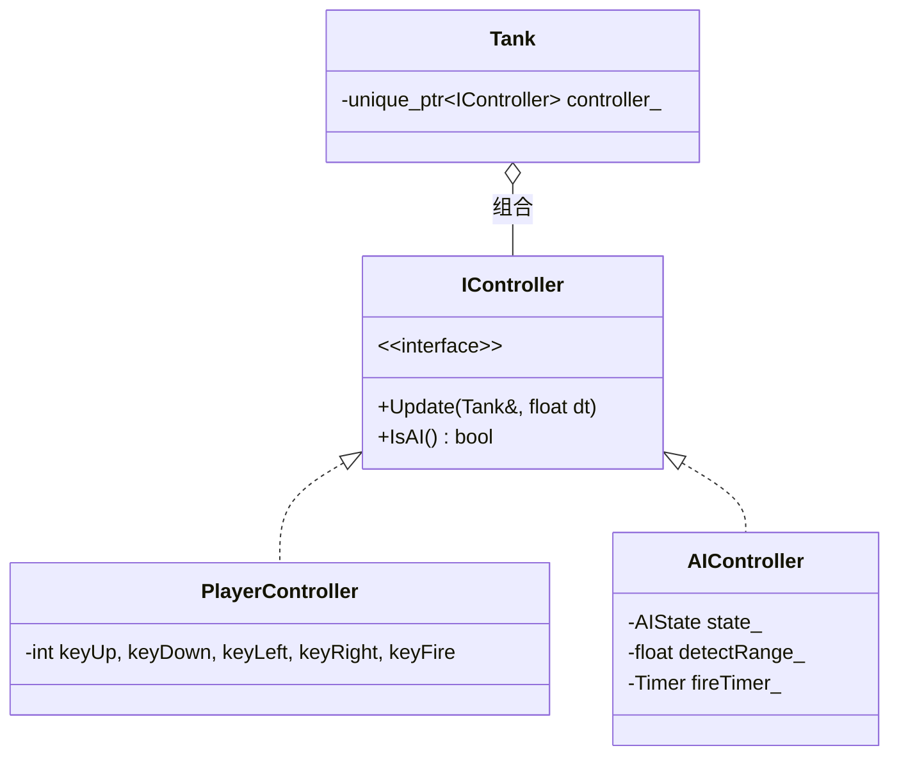
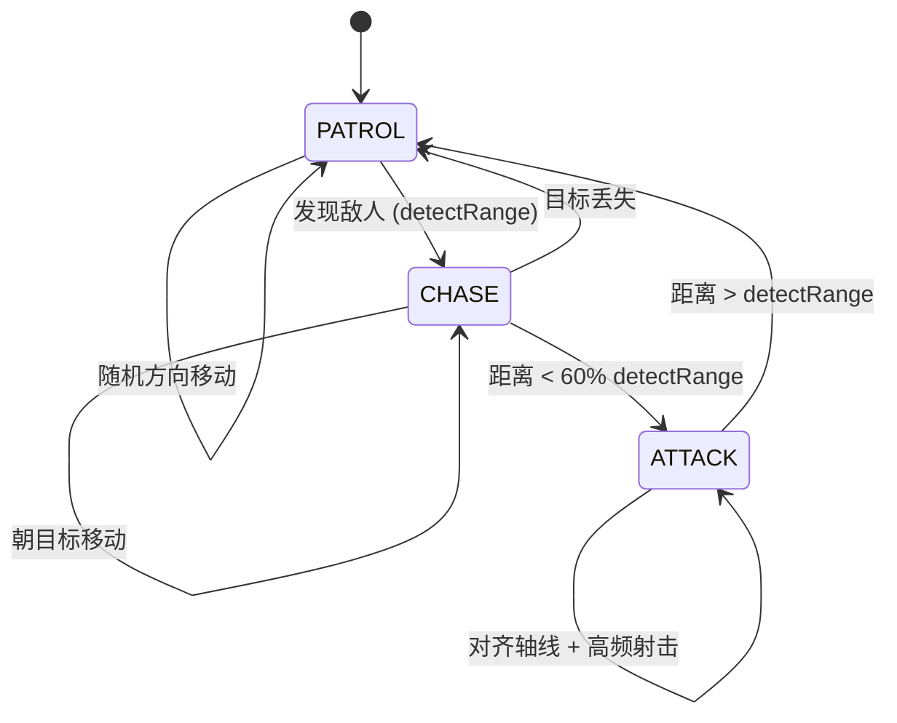
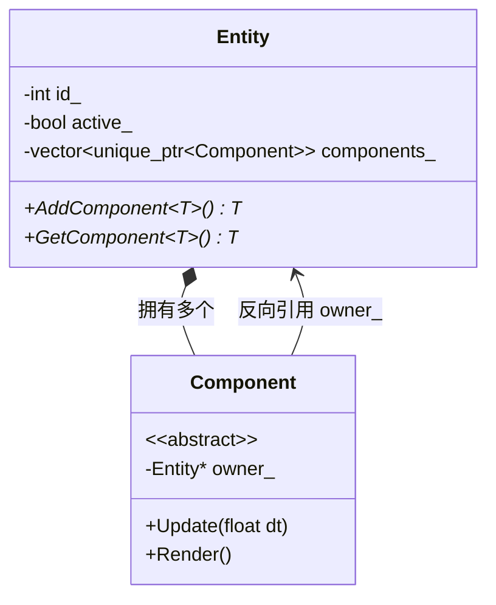
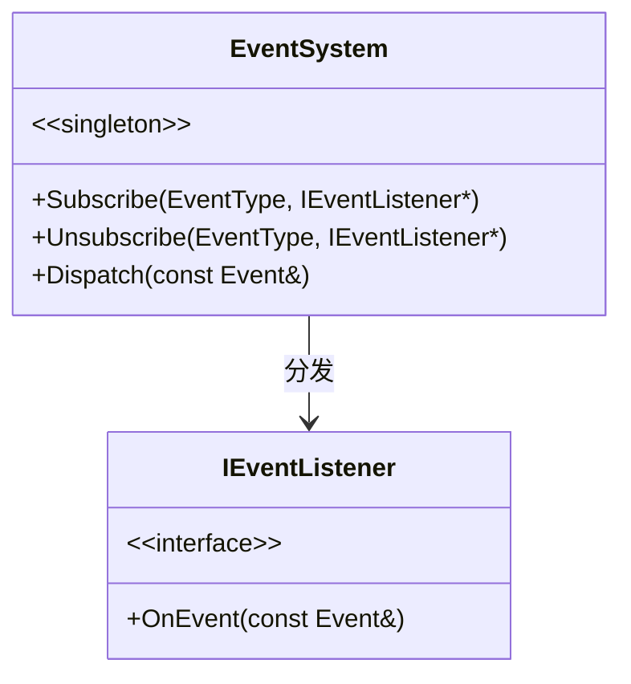
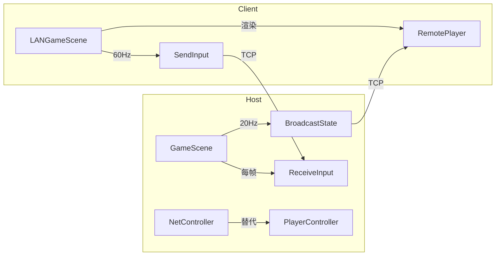

# 设计模式 — Tank Battle 90s

技术栈：**C++23 / CMake / raylib 5.5**

---

## 1. 总体设计哲学

### 1.1 "组合优于继承"

核心决策：**不通过继承层次区分游戏实体**。

传统做法会建立 `Tank → LightTank / HeavyTank` 的继承树，但：
- 属性差异只在数值上，行为逻辑完全相同
- 新增坦克类型需要新建子类
- 不同类型可互换控制方式（人类/AI），继承无法优雅表达

做法：**一个 `Tank` 类 + `TankType` 枚举 + `TankStats` 属性表 + `IController` 策略接口**。

```cpp
class Tank {
    TankType type_;                          // 类型 (查属性表)
    std::unique_ptr<IController> controller_; // 控制策略 (人类/AI)
    Entity* entity_;                          // ECS 实体 (组件组合)
    int team_;
};
```

### 1.2 四层架构

```
Scene Layer         → 用户交互、流程控制
Game Logic Layer    → 游戏规则、实体行为
ECS Layer           → 通用实体-组件框架
Core Engine Layer   → 窗口、输入、音频、资源
```

依赖方向严格向下，禁止反向依赖。

### 1.3 所有权语义

- `std::unique_ptr` 表达独占所有权
- 裸指针表达非拥有引用（如 `Entity*` 在 `Tank` 中，由 `EntityManager` 拥有）
- `const&` 表达只读访问

---

## 2. 策略模式 — 坦克控制系统

### 2.1 设计



### 2.2 关键代码

```cpp
class IController {
public:
    virtual ~IController() = default;
    virtual void Update(Tank& tank, float dt) = 0;
    virtual bool IsAI() const = 0;
};

void Tank::Update(float dt) {
    controller_->Update(*this, dt);
    // ... 通用逻辑 (冷却、无敌、边界钳制)
}
```

### 2.3 AI 状态机



### 2.4 设计收益

| 场景 | 操作 |
|---|---|
| 新增坦克类型 | 在 `TANK_STATS` 表加一行 |
| 新增控制方式 | 实现 `IController` 子类 |
| 运行时切换 | 替换 `controller_` 指针 |

---

## 3. 组件模式 — Entity-Component 系统

### 3.1 设计



### 3.2 五种组件

| 组件 | 职责 | 数据 |
|---|---|---|
| TransformComponent | 位置、旋转 | `Vector2 position, float rotation` |
| SpriteComponent | 渲染精灵 | `Texture2D* texture, Color tint` |
| ColliderComponent | AABB 碰撞 | `CollisionLayer, Vector2 size, function onCollision` |
| HealthComponent | 生命值 | `int hp, maxHp; function onDeath` |
| MovementComponent | 移动 | `float speed; Direction direction; bool moving` |

### 3.3 类型安全的组件获取

```cpp
template<typename T>
T* GetComponent() const {
    for (auto& c : components_) {
        if (auto* ptr = dynamic_cast<T*>(c.get()))
            return ptr;
    }
    return nullptr;
}
```

### 3.4 回调机制

组件通过 `std::function` 回调实现事件通知，避免组件间直接耦合：

```cpp
health->onDeath = [this]() {
    EventSystem::Instance().Dispatch({EventType::TankDestroyed, entity_->GetId()});
    AudioManager::Instance().PlaySound("explosion");
};
```

---

## 4. 状态模式 — 场景管理

### 4.1 Scene 基类

```cpp
class Scene {
public:
    virtual ~Scene() = default;
    virtual void Enter() {}
    virtual void Exit() {}
    virtual void Update(float dt) = 0;
    virtual void Render() = 0;
    virtual bool IsOverlay() const { return false; }
};
```

`Enter/Exit` 是模板方法模式的变体：基类提供默认空实现，子类按需覆盖。

### 4.2 语义化导航

传统场景栈只提供 Push/Pop/Replace，场景需要了解栈的内部结构才能正确导航。我们提供**语义化方法**：

```cpp
class SceneManager {
public:
    void PushScene(unique_ptr<Scene>);   // 压入覆盖层
    void PopScene();                      // 弹出覆盖层
    void SetupNext(unique_ptr<Scene>);   // 流程前进
    void StartGame(unique_ptr<Scene>);   // 开始对战
    void ReturnTo(unique_ptr<Scene>,     // 语义回退
                  function<bool(const Scene&)>);
    void ReturnToMenu();                 // 回主菜单
};
```

场景只表达意图，SceneManager 负责栈的清理。

### 4.3 覆盖层机制

PauseScene 通过 `IsOverlay() = true` 声明自己是覆盖层：

```cpp
void SceneManager::Render() {
    if (scenes_.back()->IsOverlay() && scenes_.size() >= 2)
        scenes_[scenes_.size() - 2]->Render();  // 先渲染下层
    scenes_.back()->Render();  // 再渲染覆盖层
}
```

---

## 5. 工厂模式 — 坦克创建

```cpp
class TankFactory {
public:
    static unique_ptr<Tank> CreatePlayerTank(
        TankType type, int team,
        int keyUp, int keyDown, int keyLeft, int keyRight, int keyFire);
    static unique_ptr<Tank> CreateAITank(TankType type, int team);
};
```

创建流程分层：

```
TankFactory::CreateXxxTank()     → 组装 Tank + Controller (不含 Entity)
Tank::Spawn(EntityManager&, pos) → 创建 Entity + Components
GameScene::SpawnAllTanks()       → 选择出生点、配置队伍
```

---

## 6. 观察者模式 — 事件系统



事件流转示例：

```
子弹击中砖墙
  → CollisionSystem 检测碰撞
  → 设置砖墙瓦片为 EMPTY
  → EventSystem::Dispatch({WallDestroyed, ...})
  → GameScene: 10% 概率生成道具
  → ParticleSystem: 生成碎片粒子
```

场景在 `Enter()` 订阅，`Exit()` 取消订阅，避免悬空指针。

---

## 7. 单例模式 — 全局服务

三个单例：`EventSystem`、`ResourceManager`、`AudioManager`。

```cpp
class EventSystem {
public:
    static EventSystem& Instance() {
        static EventSystem instance;  // Meyers' Singleton
        return instance;
    }
};
```

使用 Meyers' Singleton (C++11 保证线程安全)。只用于真正的全局唯一服务。

---

## 8. 数据驱动 — 坦克属性表

### 对比

| 维度 | 继承方式 | 数据驱动 (采用) |
|---|---|---|
| 新增类型 | 新建子类 | 加一行数据 |
| 类的数量 | O(类型 x 控制) | O(1) + 接口 |
| 属性调整 | 改代码重编译 | 改数据表 |

### 实现

```cpp
struct TankStats {
    float moveSpeed, bulletSpeed;
    int bulletDamage, maxHealth, armor;
    float fireCooldown;
    int maxBullets;
    const char* name, *spritePath;
};

inline const unordered_map<TankType, TankStats> TANK_STATS = {
    { TankType::LIGHT,  {100.f, 350.f, 1, 1, 0, 0.5f, 2, "LIGHT",  "..."}},
    { TankType::MEDIUM, { 80.f, 300.f, 2, 2, 1, 0.7f, 1, "MEDIUM", "..."}},
    { TankType::HEAVY,  { 55.f, 250.f, 2, 3, 2, 1.0f, 1, "HEAVY",  "..."}},
    { TankType::SPEED,  {130.f, 400.f, 1, 1, 0, 0.3f, 3, "SPEED",  "..."}},
};
```

---

## 9. 语义化导航 — 设计演进

### 第一版：纯栈操作

```cpp
manager_->PushScene(charSelect);
manager_->PushScene(teamSelect);
manager_->ReplaceScene(game);
```

**问题：** 设置流程残留在栈中。游戏结束后栈变成 `[Menu, Lobby, CharSelect, TeamSelect, MapSelect, Lobby]`。

### 第二版：ResetToScene

```cpp
manager_->ResetToScene(lobby);
```

**问题：** Lobby 没有 Menu 在栈底，ESC 导致空栈崩溃。

### 第三版：语义化导航 (当前)

```cpp
manager_->SetupNext(mapSelect);     // 替换栈顶
manager_->StartGame(game);          // 清除设置链
manager_->ReturnToMenu();           // 回主菜单
```

场景只表达"去哪里"，SceneManager 负责栈清理。

### 栈不变量

1. **栈永不为空** — 最少有 MenuScene
2. **Menu 始终在栈底** — 任何 ESC 都能回到菜单
3. **设置链最多一层** — Setup / MapSelect 互斥存在

---

## 10. PIMPL 模式 — 网络模块编译隔离

### 问题

`NetworkManager` 需要 Winsock2，但 `winsock2.h` 与 raylib 的 `Rectangle`、`DrawText` 冲突。

### 设计

```cpp
// NetworkManager.h — 不包含 socket 头文件
class NetworkManager {
public:
    bool Listen(uint16_t port);
    bool Connect(const std::string& ip, uint16_t port);
    // ...
private:
    struct Impl;
    std::unique_ptr<Impl> impl_;
};
```

```cpp
// NetworkManager.cpp — socket 头文件仅在此处
struct NetworkManager::Impl {
    socket_t tcpSocket = INVALID_SOCK;
    // ...
};
```

### 所有权转移

LAN 场景中 `NetworkManager` 需要从 `LANLobbyScene` 转移到 `GameScene`/`LANGameScene`。使用前向声明删除器避免要求完整类型：

```cpp
// NetworkOwner.h
struct NetworkDeleter { void operator()(NetworkManager* p) const; };
using NetworkManagerPtr = std::unique_ptr<NetworkManager, NetworkDeleter>;
```

---

## 11. Host-Authoritative 网络模型

### 架构



### NetController

```cpp
class NetController : public IController {
    void Update(Tank& tank, float dt) override {
        if (currentInput_ & NET_INPUT_UP) movement->SetDirection(UP);
        if (currentInput_ & NET_INPUT_FIRE) tank.Fire();
    }
    void ApplyInput(uint8_t mask) { currentInput_ = mask; }
};
```

Host 为远程玩家创建 NetController，从缓存的网络输入驱动坦克，替代键盘读取。

---

## 12. 模式协作总览

```mermaid
graph TD
    subgraph 创建型
        TF[TankFactory] -->|创建| T[Tank]
        EM[EntityManager] -->|创建| E[Entity]
    end

    subgraph 结构型
        E -->|拥有| C[Component x 5]
        T -->|组合| IC[IController]
    end

    subgraph 行为型
        SM[SceneManager] -->|管理| S[Scene x 14]
        ES[EventSystem] -->|通知| EL[IEventListener]
        IC <|.. PC[PlayerController]
        IC <|.. AC[AIController]
    end

    subgraph 数据驱动
        TT[TankType + TankStats] -->|查表| T
        GM[GameMap + TileType] -->|查表| CS[CollisionSystem]
    end
```

### 使用频率

| 模式 | 使用位置 | 频率 |
|---|---|---|
| 策略 | IController | 每个坦克实例 |
| 组件 | Entity + Components | 每个实体实例 |
| 状态 | Scene 子类 | 每次场景切换 |
| 工厂 | TankFactory | 每次创建坦克 |
| 观察者 | EventSystem | 每次游戏事件 |
| 单例 | EventSystem / ResourceManager / AudioManager | 程序生命周期 |
| PIMPL | NetworkManager | 网络模块编译隔离 |
| Host-Authoritative | GameScene + LANGameScene | 网络同步 |
